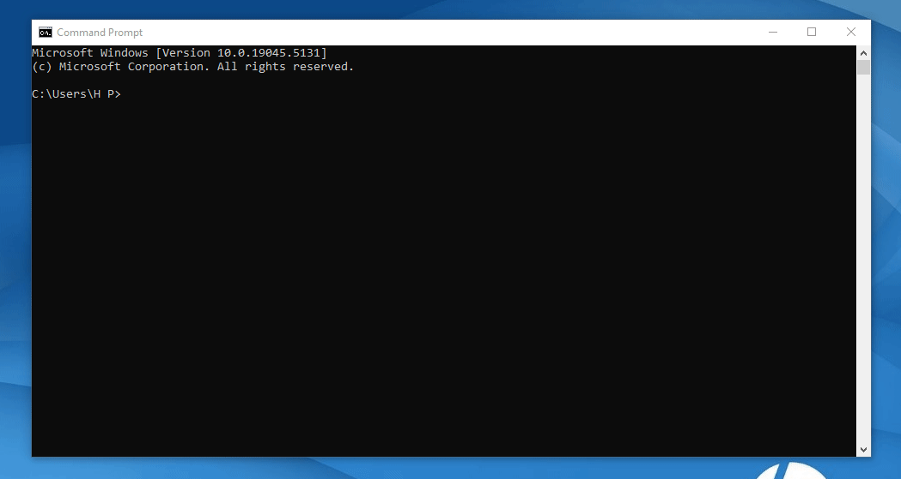

# TypeScript Introduction

## What is TypeScript?
**TypeScript** is a *syntactic superset of JavaScript* which adds static typing.

This basically means that TypeScript adds syntax on top of JavaScript, allowing developers to add types.

It was developed by **Microsoft** and has become popular for building large-scale applications because it offers strong tooling and type safety, which JavaScript lacks.

## Why should we use TypeScript?
**JavaScript** is a loosely typed language. It can be difficult to understand what types of data are being passed around in JavaScript.

In JavaScript, function parameters and variables don't have any information! So developers need to look at documentation, or guess based on the implementation.

**TypeScript** allows specifying the types of data being passed around within the code, and has the ability to report errors when the types don't match.

For example, TypeScript will report an error when passing a string into a function that expects a number. JavaScript will not.

## IDE
### Visual Studio Code
Visual Studio Code provide IntelliSense and other features like autocompletion, which make development more productive.


# How to Get Started with TypeScript
## Installation
-  **Install TypeScript globally using npm**
    ```cd
    npm install -g typescript
    ```
    - Check the version of the TypeScript compiler (tsc) 
        ```cd
        npx tsc -v
        ```
    

- **Create a TypeScript File**

   Create a `.ts` file, e.g., `index.ts.`

  

- **Compile the TypeScript File:**
Compile the TypeScript file into JavaScript using the TypeScript compiler (tsc):
    ```cd
    tsc index.ts
    ```

- **Run the JavaScript File:**

    After compilation, a `.js` file will be created, which you can run with *Node.js* or in a browser.

    ```cd
    node index.js
    ```
    

 - **For Error:** 
    ```cd
    tsc -init
    ```
    

    [Day 02 >>](/Class02/READ02.md)


